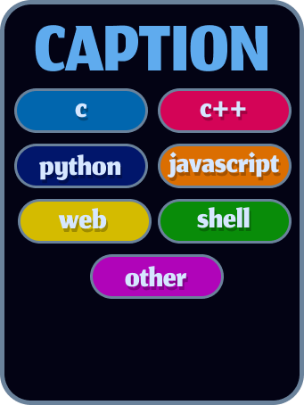

  

  
  

---

  
<h2>🛠️ Working on 🛠️</h2>

  

    
    
    
    
  

---

<h2>4️⃣2️⃣ Projects</h2>

 

<!-- COMMON CORE -->

<strong>🧱 Common core 🧱</strong>

 

Circle 5

  

Circle 4

  
  

Circle 3

  
  
  

Circle 2

  
  
  

Circle 1

  

<!-- PISCINE -->

<strong>🌊 Piscine 🌊</strong>

 

SHELL Piscine

  
  

C Piscine

  
  
  
  
  
  
  
  

---
# 👤 Perso 👤

  

