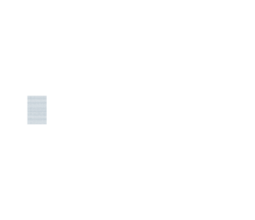

  

# 🛠️ Working on 🛠️

---

# 4️⃣2️⃣ Projects

## 🧱 Common core 🧱
### Circle 5

### Circle 4

### Circle 3

### Circle 2

### Circle 1

## 🌊 Piscine 🌊
### SHELL Piscine

### C Piscine

---
# 👤 Perso 👤

  

